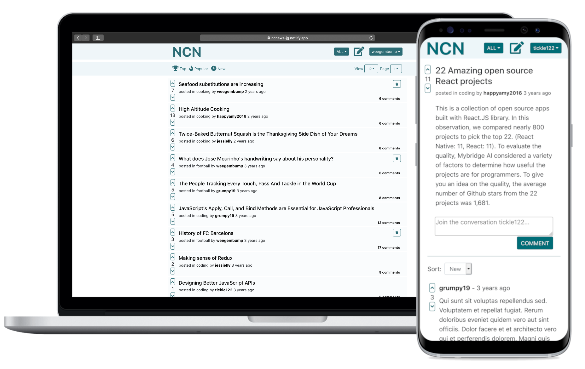

# Northcoders News

A full stack news aggregation and discussion site created with react</br>

### Front end hosted at https://ncnews-jg.netlify.app/

### API hosted at https://jg-news-app.herokuapp.com/api

</br>


## Table of Contents

- [About](#about)
  - [Features](#features)
- [Technologies](#technologies)
- [How to Use](#how-to-use)
  - [Code](#code)

## About

This is a React frontend for a full stack news aggregation and discussion website, styled after a minimalist reddit.</br>
The site is not set up with user authentication, rather the user selection is available to show that article and comment deletion is restricted to the author.</br>
</br>
This frontend requests data from a REST API created with a PostgrSQL database and Express server: [backend](https://github.com/1jgrant/nc-news-backend)
</br>
The front end news site is hosted at https://ncnews-jg.netlify.app/ </br>
The API is hosted on Heroku, where you may view information on all endpoints https://jg-news-app.herokuapp.com/api </br>

### Features

- Responsive to mobile and desktop
- View and sort articles by topic and various engagement statistics
- Users may post new articles and comment on existing ones
- Users may delete their own articles and comments
- Users may vote on articles and comments
- Pagination of articles - default 10 per page
- You my view user profiles including a list of articles they have submitted
- Error handling for invalid routes and bad requests
  </br>

## Technologies

- [React](https://reactjs.org/)
- [Axios](https://www.npmjs.com/package/axios)
- [Reach Router](https://reach.tech/router/)
- [Styled Components](https://styled-components.com/)
- [React Bootstrap](https://react-bootstrap.github.io/)
- [Jest](https://jestjs.io/)

## How to Use

### Code

- Fork and clone the repo

To install with all dependencies & start the react app:

```
$ cd ../nc-news-frontend
$ npm i
$ npm start
```
